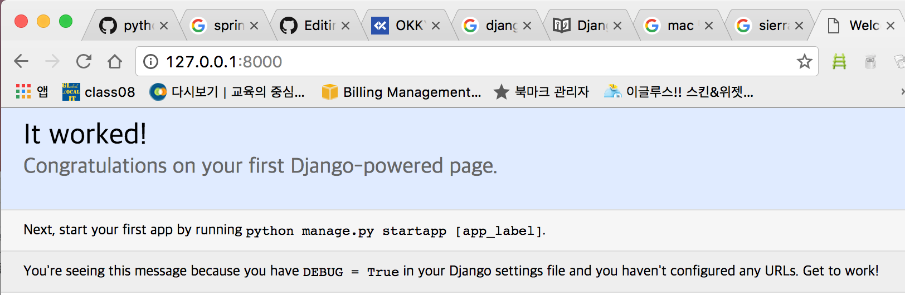

# Django개발의 일반적인 순서
##### INDEX
> 1. 프로젝트 생성
> 2. 프로젝트 기본 구조 수정
> 3. 어플리케이션 생성
> 4. 데이터베이스 선택, 세부사항 반영
> 5. 동작여부 확인, 프로젝트 테스트
> 6. 프로젝트 관리자 계정생성, 프로젝트 관리자 페이지 접속
> 7. 샘플 어플리케이션 작성, MTV 각 계층의 동작방식

## 1. 프로젝트 생성
### 프로젝트의 생성은 django-admin.py를 통해 생성한다.
프로젝트 생성시 프로젝트에 필요한 파일들을 모두 django-admin.py가 알아서 자동으로 프로젝트의 필요한 파일들을 생성해준다.  
(django의 버전별 공식 repository에서 직접 다운받아 지도록 django-admin.py내에 기술되어 있는 것으로 보인다. 자세한 내용은 직접 django framework를 분석해보면 될 듯하다.)
```bash
$ django-admin.py startproject basic_prj
$ tree
.
└── basic_prj
    ├── basic_prj
    │   ├── __init__.py
    │   ├── settings.py
    │   ├── urls.py
    │   └── wsgi.py
    └── manage.py
```
## 2. 프로젝트 기본 구조 수정
### 생성된 프로젝트의 디렉터리의 이름과 그 내부에 디폴트로 생성된 디렉터리의 이름이 같으므로 프로젝트의 이름을 변경해준다.
**$ django-admin.py startproject [프로젝트명]** 으로 프로젝트를 생성하면 [프로젝트명]으로 디렉터리가 생기고 그 내부에도 [프로젝트명] 디렉터리가 생기는 것을 볼 수 있다. 추후 **상위 디렉터리의 [프로젝트명]과 하위디렉터리의 [프로젝트명]을 지칭할때 혼동될 여지가 있기 때문에** 상위 디렉터리의 [프로젝트명]을 수정해주는 것이 정신건강상 이롭다.  
```bash
$ mv basic_prj helloworld
```
## 3. 어플리케이션 생성
보통 django 프로젝트 진행시 어떠한 기능을 추가해서 개발하고자 할 때 그 단위를 어플리케이션이라는 개념으로 따로 분류해서 개발한다. 여기서 말하는 어플리케이션은 하나의 디렉터리다. 즉, 무언가 신기능을 독립적으로 추가하고자 할때 디렉터리를 생성해 그곳에서 독립적으로 개발하는 방식이다.  
### manage.py - 어플리케이션 생성 도구 
어플리케이션 생성시에는 프로젝트 디렉터리내에 생성된 manage.py를 이용한다. 프로젝트 생성시에는 django-admin.py를 이용해 프로젝트를 생성한 것과 구별해서 기억하자.  

> **django-admin.py 가 자동완성되는 이유?**  
*python,django 설치 시 전역 path에 지정된 python디렉터리에 의해 django-admin.py가 자동완성된다-이부분 차후 다시 정리(시간이 부족하다)*

```bash
$ cd helloworld
$ python manage.py startapp sample_app
$ ls
basic_prj  manage.py  sample_app
$ tree
.
├── basic_prj
│   ├── __init__.py
│   ├── __init__.pyc
│   ├── settings.py
│   ├── settings.pyc
│   ├── urls.py
│   └── wsgi.py
├── manage.py
└── sample_app
    ├── __init__.py
    ├── admin.py
    ├── apps.py
    ├── migrations
    │   └── __init__.py
    ├── models.py
    ├── tests.py
    └── views.py

3 directories, 14 files
```
## 4. 데이터베이스 선택, 세부사항 반영
### DB의 변경사항을 반영할 때는 일반적으로 manage.py에 migrate옵션을 주여 명령을 내린다.
데이터베이스로는 django에 기본으로 지정된 SQLite3를 이용할 수도 있고, Mysql/MariaDB, PostgreSql, Oracle등을 이용할 수 있다. 여기서는 SQLite3를 설정하는 부분을 먼저 다루고 그 후에 Mysql/MariaDB를 설정하는 방식을 다뤄보고자 한다.  
### 1) SQLite3를 이용한 Database 반영
$ python manage.py migrate은 데이터베이스에 변동사항이 있을 경우 반영해주는 명령어다. 프로젝트 생성 초기에 데이터베이스 관련설정은 settings.py등에 디폴트로 SQLite를 사용하도록 지정되어 있지만, Database에 이식되어있지 않은 상태이다. 따라서 프로젝트, 어플리케이션의 생성이 마무리 되면 꼭 python manage.py migrate명령을 내려주어야 한다.
```bash
$ python manage.py migrate
$ ls
basic_prj  db.sqlite3 manage.py  sample_app
```
ls 명령을 통해 확인해보면 db.sqllite3라는 파일이 새롭게 추가된 것을 확인 가능하다.  
### 2) MariaDB,Mysql,PostgreSql을 사용하는 경우
## 5. 동작여부 확인, 프로젝트 테스트
### 작성한 서버의 동작을 확인할 때 manage.py에 runserver 옵션을 주어 동작여부를 확인할 수 있다.
```bash
$ python manage.py runserver
Performing system checks...

System check identified no issues (0 silenced).
May 01, 2017 - 10:16:17
Django version 1.11, using settings 'basic_prj.settings'
Starting development server at http://127.0.0.1:8000/
Quit the server with CONTROL-C.
```
실행 결과  


## 6. 프로젝트 관리자 계정생성, 프로젝트 관리자 페이지 접속
### 관리자 계정 생성
```bash
$ python manage.py createsuperuser
Username (leave blank to use 'soon'): wonderboy
Email address: wonderboy39@outlook.com
Password:
Password (again):
Superuser created successfully.
```
### 관리자 페이지 접속 - 차후 다시 정리, 스크린샷 추가
## 7. 샘플 어플리케이션 작성, MTV 각 계층의 동작방식
#### INDEX
> 1) 샘플 프로젝트 수행계획
> 2) DB테이블 구성 (VideoUrl, VideoCategory)
> 3) 페이지 이동 flow - 추후 다시 정리
> 4) 모델설계, 구현 및 코딩
> 5) 테이블 반영, Database변경사항 반영
> 6) 어플리케이션 기능 개발 - View, Template 구현

### 1) 샘플 프로젝트 수행계획
youtube의 동영상 링크들을 저장하는 어플리케이션을 아주 기본적인 뼈대만을 가지도록 만들어보고자 한다.  

### 2) DB 테이블 구성
SQLite3를 사용해서 DB테이블구성을 진행할때 굳이 SQL을 사용해 테이블을 미리 생성하지 않아도 된다. 하지만 MariaDB/MySql/PostgreSql사용시에는 테이블을 생성해주어야 하는 것으로 보인다.  
SQLite를 사용해 구성할 경우를 먼저 정리하고 그 후에 MariaDB/Mysql을 사용할 경우를 정리해보고자 한다.  
#### VideoUrl (테이블 명세)
 |컬럼 | 타입 | 제약조건 | 용도 |
 |:---|:---:|:------:|----:|
 | id | integer    | Not Null   | Primary Key|
 | subject | varchar(50)    | Not Null   | 동영상 제목 |
 | url | varchar(100)    | Not Null   | url  |
 | pub_date | datetime    | Not Null   | 등록날짜 |  
 
*pub_date항목은 추후 기능 추가를 통해 추가하고자 한다. 이 글을 쓰는 목적자체가 정말 단순무식한 골격의 프로젝트 작성절차를 정리하는 것이 목적이기 때문에 해당 내용은 basic-flow3.md에 정리할 예정이다.*

#### VideoCategory (테이블 명세)
 |컬럼 | 타입 | 제약조건 | 용도 |
 |:---|:---:|:------:|----:|
 | id | integer    | Not Null   | Primary Key |
 | category | varchar(20)    | Not Null   | Foreign Key |
 | pub_date | datetime    | Not Null   | 등록날짜  |  
 
*pub_date항목은 추후 기능 추가를 통해 추가하고자 한다. 이 글을 쓰는 목적자체가 정말 단순무식한 골격의 프로젝트 작성절차를 정리하는 것이 목적이기 때문에 해당 내용은 basic-flow3.md에 정리할 예정이다.*
### 3) 페이지 이동 flow - 추후 다시 정리
### 4) 모델설계, 구현 및 코딩
모델 설계, 구현 및 코딩의 순서를 요약해보면 아래와 같다.
 > 4.1) **settings.py(DATABASE, INSTALLED_APPS, UTC) : 데이터베이스 지정**  
 > 4.2) **모델 설계**  
 > 4.3) **sample_app/models.py에 모델 코딩**  

#### 4.1) settings.py (DATABASE, INSTALLED_APPS)설정
settings.py는 django 프로젝트 생성시 기본으로 생성된 디렉터리인 basic_prj내에 존재한다. (basic_prj는 $django-admin.py startproject [프로젝트명] 으로 생성된 디렉터리다.)
1. INSTALLED_APPS항목에 생성한 helloworld를 추가해준다. (helloworld는 $python manage.py startapp helloworld를 통해 생성된 프로젝트 내에 생성된 어플리케이션 디렉터리다.)
2. DATABASES항목에 사용하고자 하는 database를 지정해준다. (SQLite를 사용할 경우 기본 설정을 그대로 두면되고, SQLite외의 DB를 사용할 경우 부가적으로 다른 설정을 사용하면 된다. )
3. TIMEZONE 항목을 수정해준다.  

```bash
$ vim basic_prj/settings.py
```

```python
...
...
# Database
# https://docs.djangoproject.com/en/1.11/ref/settings/#databases

DATABASES = {
    'default': {
        'ENGINE': 'django.db.backends.sqlite3', # SQLite외의 다른 DB를 사용할 경우 이 부분을 수정
        'NAME': os.path.join(BASE_DIR, 'db.sqlite3'), # SQLite외의 다른 DB를 사용할 경우 이 부분을 수정
    }
}
...
...
# Application definition

INSTALLED_APPS = [
    'django.contrib.admin',
    'django.contrib.auth',
    'django.contrib.contenttypes',
    'django.contrib.sessions',
    'django.contrib.messages',
    'django.contrib.staticfiles',
    'sample_app', # startapp명령으로 생성한 애플리케이션 디렉터리의 이름을 이곳에 추가(','를 꼭 생략하면 안된다.)
]
...
...
#TIME_ZONE = 'UTC'
TIME_ZONE = 'Asia/Seoul'
```
#### 4.2) 모델 설계
이번 글에서는 별도의 카테고리 설정 없이 url을 등록하는 부분까지만 정리할 것이다. 카테고리 기능까지 추가하려면 글이 길어지기 때문에 추후에 basic-flow2.md파일에서 정리하고자 한다. 여기서는 카테고리, 비디오 테이블 모두의 테이블명세를 모두 설계해서 문서로 남겼다. (basic-flow2.md파일에서도 다시 정리할 예정)
#### 4.2.1) VideoCategory 테이블의 각 컬럼과 VideoCategory클래스 각 변수간 매핑
 |컬럼 | 타입 | 클래스의 멤버필드 | django내장 클래스(ORM) |
 |:---|:---:|:------:|----:|
 | id | integer    | videocategory_id   | PK는 django에서 자동 생성 |
 | category | varchar(20)    | category   | models.CharField(max_length=20) |
 | pub_date | datetime    | pub_date   | models.DateTimeField('date  published') |  
 
*pub_date항목은 추후 기능 추가를 통해 추가하고자 한다. 이 글을 쓰는 목적자체가 정말 단순무식한 골격의 프로젝트 작성절차를 정리하는 것이 목적이기 때문에 해당 내용은 basic-flow3.md에 정리할 예정이다.*
#### 4.2.2) VideoUrl 테이블의 각 컬럼과 VideoUrl클래스 각 변수간 매핑
 |컬럼 | 타입 | 클래스의 멤버필드 | django내장 클래스(ORM) |
 |:---|:---:|:------:|----:|
 | id | integer    | videourl_id   | PK는 django에서 자동 생성 |
 | category | varchar(20)    | category   | models.ForeignKey(VideoCategory) |
 | subject | varchar(50)    | subject   | models.CharField(max_length=50) |
 | url | varchar(100)    | url   | models.CharField(max_length=100)  |
 | description | varchar(400)    | url   | models.CharField(max_length=400)  |
 | pub_date | datetime    | pub_date   | models.DateTimeField('date  published') |  
 
*pub_date항목은 추후 기능 추가를 통해 추가하고자 한다. 이 글을 쓰는 목적자체가 정말 단순무식한 골격의 프로젝트 작성절차를 정리하는 것이 목적이기 때문에 해당 내용은 basic-flow3.md에 정리할 예정이다.*
> **PK** : 클래스에 지정해주지 않아도 장고는 항상 PK에 대한 속성을 Not Null 및 Auto Increment로 지정해준다. 변수의 이름은 테이블명의 소문자를 접두어로 해서 자동으로 만들어준다.  
> **DateTimeField** : date_published는 pub_date컬럼에 대한 레이블 문구다.  
> **FK(Foreign)** : 하나의 테이블과 다른 테이블을 연결하기 위한 키다. VideoCategory클래스의 id와 VideoUrl클래스를 연결하기 위해 지정했다. VideoCategory의 videocategory_id를 VideoUrl클래스에서 직접 설정할 필요까지는 없다. VideoCategory클래스를 VideoUrl클래스의 외래키 변수에 ForeignKey메서드에 직접 지정해주면 된다.  

#### 4.3) sample_app/models.py에 모델 코딩
models.py는 보통 어플리케이션 단위로 수정한다. 해당 어플리케이션에서 독립적으로 수행되어야하는 이유 때문일 것이다.
```bash
$ vim sample_app/models.py
```
```python
# -*- coding: utf-8 -*-
from __future__ import unicode_literals

from django.db import models

# Create your models here.
class VideoCategory(models.Model):
    category = models.CharField(max_length=20)
    #pub_date = models.DateTimeField('date published') # 추후 다시 추가
    def __unicode__(self):
        return self.category

class VideoUrl(models.Model):
    category = models.ForeignKey(VideoCategory)
    subject = models.CharField(max_length=50)
    url = models.CharField(max_length=100)
    description = models.CharField(max_length=400)
    #pub_date = models.DateTimeField('date published') # 추후 다시 추가
    def __unicode__(self):
        return self.subject
```
*VideoCategory의 기본키를 VideoUrl이 참고하도록 설계했으므로 VideoCategory 클래스가 먼저 기술되어야 한다. python은 스크립트언어이므로 한 라인씩 차례로 읽는다. 따라서 VideoCategory클래스를 VideoUrl클래스 뒤에 기술할 경우 파이썬 인터프리터는 VideoUrl클래스가 참조할 VideoCategory가 없는 것으로 생각한다.( VideoCategory가 정의되기 전에 VideoUrl클래스를 정의하게 되므로)*
### 5) 테이블 반영, Database변경사항 반영
정의한 테이블에 대한 모델을 반영하기 위해서는 Database를 등록한 테이블을 Admin사이트에 반영해야 한다. 이후 manage.py를 통해 반영하기 위해 makemigrations, migrate명령을 내린다. makemigration명령은 해당 어플리케이션 디렉터리 내에 마이그레이션 파일들을 생성하며 migrate명령은 데이터베이스에 테이블을 만드는 역할을 한다.

#### 테이블 반영 절차
> 5.1) **Admin사이트에 테이블 반영**  
>  admin.py에 모델 클래스를 import하고, 모델들을 register(모델명)를 통해 등록한다.  
> 5.2) **데이터베이스 변경사항 반영**  
>  maange.py파일에 makemigrations, migrate명령을 통해 Admin사이트에 테이블 내용을 반영, 데이터베이스 변경사항을 물리적으로 반영하는 절차를 거친다.  

#### 5.1) Admin사이트에 테이블 반영
admin사이트에 테이블을 반영하기 위해서는 어플리케이션 디렉터리의 admin.py에 admin모듈의 register함수를 통해 등록하면 된다.  
```bash
$ vim sample_app/admin.py
```
```python
# -*- coding: utf-8 -*-
from __future__ import unicode_literals

from django.contrib import admin
from sample_app.models import VideoCategory, VideoUrl # 추가된 내용

# Register your models here.
admin.site.register(VideoUrl) # 추가된 내용
admin.site.register(VideoCategory # 추가된 내용
```
#### 5.2) 데이터베이스에 변경사항 반영
makemigrations, migrate명령을 통해 Admin사이트에 테이블내용을 반영하고, 데이터베이스 변경사항을 물리적으로 변경한다. makemigrations, migrate등의 작업을 수행하는 것은 manage.py이다. manage.py는 settings.py의 INSTALLED_APPS를 참고해 어플리케이션을 찾은 후 models.py에 추가한 모델클래스를 참고해 테이블을 만든다. makemigrations, migrate명령 각각의 역할은 아래와 같다.
> **makemigrations 명령** : 어플리케이션 디렉터리(sample_app)내에 마이그레이션 파일들을 생성  
> **migrate 명령** : 데이터베이스에 테이블을 만드는 역할을 수행  

```bash
$ python manage.py makemigrations
Migrations for 'sample_app':
  sample_app/migrations/0001_initial.py
    - Create model VideoCategory
    - Create model VideoUrl

$ python manage.py migrate
Operations to perform:
  Apply all migrations: admin, auth, contenttypes, sample_app, sessions
Running migrations:
  Applying sample_app.0001_initial... OK
```
  
### 6) 어플리케이션 기능 개발 - View, Template 구현
#### 이번 글에서의 구현 목표
이번 글에서는 youtube scrap기능의 vol0.0.1버전을 구현하고자 한다. vol0.0.1버전에서 구현하고자 하는 구현명세는 아래와 같다.  
> **index.html : ** 'Add URL', 'Show List'를 link로 가지고 있는 페이지다.  
> * **Add URL** : youtube url, 제목을 입력하는 페이지인 write.html로 이동하도록 하는 기능이다.  
> * **Show List** : show list, 지금까지 입력한 모든 링크, youtube동영상 제목을 모두 나열해주는 list.html페이지로 이동하는 기능이다.  

> **write.html : ** 제목,URL을 입력하는 폼(입력양식)이다.  
> **list.html : ** DB에 등록된 모든 link,url에 대한 로우를 출력해주는 페이지다.  

#### INDEX - 일반적인 View, Template 구현절차
> **6.1) URLConf 설계,수정/구현**  
> : 6.1.1) URLConf설계  
> : 6.1.2) URLConf의 내용 수정 (urls.py의 urlpatterns내용 수정)  
>  
> **6.2) 뷰 함수, 템플릿 작성**  
> : 6.2.1) views.py에 템플릿(HTML)파일을 지정해주는 함수 호출로직(render()) 구현  
> : 6.2.2) HTML(템플릿 언어 이용) 파일 작성  

#### 6.1) URLConf 설계,수정/구현
#### 6.1.1) URLConf 설계
작성하고자 하는 페이지가 3개이므로 3개의 페이지를 처리하기 위한 뷰와 템플릿을 구현해야 한다. 각 HTML(장고 템플릿 적용)파일과 URL, 뷰함수를 나열해보면 아래와 같다.  
  
 |URL    | 뷰    | 해당 뷰 함수의 역할   |
 | :- | :-: | -: |
 | /sample_app/index/   |  index()  |  index.html 템플릿 렌더링 |  
 | /sample_app/write/   |  write()  |  write.html 템플릿을 렌더링 |  
 | /sample_app/write_ok/   |  write_ok()  |  write.html 에서 넘겨 받은 폼을 POST방식으로 처리 |  
 | /smaple_app/list/    |  list()   |  list.html 템플릿을 렌더링 |  
 
위와 같이 view의 함수의 동작과 url을 매핑해놓은 것을 URLConf라고 부른다.  
#### 6.1.2) URLConf 수정/구현
**INDEX**  
> URLConf를 수정하는 일반적인 방식
> 정규표현식
> urls.py 수정

#### URLConf를 수정하는 일반적인 방식
URLConf를 수정할 때 보통 urls.py의 urlpatterns 라는 리스트에 해당 매핑을 추가하는 방식으로 추가한다. URLConf를 수정하는 방식은 아래와 같이 두 가지가 있다. (하나는 프로젝트 생성시 기본으로 만들어진 urls.py의 urlpatterns내부의 매핑을 수정하는 방식이고 다른 하나는 새로 추가한 어플리케이션의 디렉터리 내부에 있는 urls.py내부의 urlpatterns를 수정하는 방식이다.)
> 1) base_prj/urls.py를 수정하는 방식  
> 2) base_prj/urls.py에 namespace를 선언하고, sample_app/urls.py를 수정하는 방식  

1) 의 방식은 프로젝트를 처음 생성할때 디폴트로 생성된 디렉터리 내의 urls.py내에서 urlpatterns 자료구조 내에 들어가는 내용을 수정하는 것이다.  
2) 의 방식은 디폴트 어플리케이션 디렉터리(base_prj)내의 urls.py의 urlpatterns내부에 해당 어플리케이션에 대한 namespace를 추가해준 후, 새로 추가한 어플리케이션(sample_app)에 대한 URL접근매핑을 urls.py의 urlpatterns에 Namespace와 함께 추가해주는 방식이다.  
**여기서는 2)의 방식을 사용하여 구현하고자 한다.**  

#### 정규표현식
URLConf를 수정하기 위해 urls.py의 url함수를 수정할때 자주 사용되는 정규표현식은 아래와 같다.  
자주 사용되는 것들만을 여기서 정리하기로 하고 그 외에 다른 표현식들은 따로 url_regex.md파일에 정리하고자 한다.  
  
|  표현식  |  의미  |  
 | :-: | :-: |  
 | . (Dot)   |  모든 문자 하나 |  
 | ^ (Caret)  |  문자열의 시작 |  
 | $  |  문자열의 끝 |  
 | +  |  1번이상 반복, {1,}와 동일 |  
 | ?  |  0번 또는 1번 반복, {0,1}과 동일 |  
 | \W |  영문, 숫자 또는 밑줄 한개, [0-9a-zA-Z_]와 동일 |  
 | \d |  숫자 한개, [0-9]와 동일 |  
  
#### urls.py 수정
1) basic_prj/urls.py의 urlpatterns에 namespace 추가  
2) sample_app/urls.py의 urlpatterns에 사용하고자 하는 url추가  

**basic_prj/urls.py수정**  
```python
from django.conf.urls import include, url
from django.contrib import admin

urlpatterns = [
    url(r'^admin/', admin.site.urls),
    url(r'^sample_app/', include('sample_app.urls', namespace='sample_app')),
    #url(r'^sample_app/', include("smaple_app.urls", namespace="sample_app")),
]
```
**sample_app/urls.py수정**  
 \- sample_app디렉터리에는 urls.py가 존재하지 않는다. 따라서 urls.py를 생성해서 basic_prj/urls.py에 작성했던 내용을 복사해 붙여넣기 한 후에 아래와 같이 수정한다.  

```python
$ vim sample_app/urls.py
from django.conf.urls import url
from sample_app import views

urlpatterns = [
    #url(r'^sample_app/', include('smaple_app.urls', namespace="sample_app")),
    #url(r'^P<videourl_id>\d+/$', views.)
    url(r'^index/$', views.index, name='index'),
    url(r'^write/$', views.write, name='write'),
    url(r'^write_ok/$', views.write_ok, name='write_ok'),
    url(r'^list/$', views.list, name='list'),
]
```

#### 6.2) 뷰 함수, 템플릿 작성
#### 6.2.1) views.py에 템플릿(HTML)파일을 지정해주는 함수 호출로직(render()) 구현  
**sample_app/views.py 수정**  
```python
# -*- coding: utf-8 -*-
from __future__ import unicode_literals

from django.shortcuts import render
from sample_app.models import VideoUrl, VideoCategory

# Create your views here.
def index(request):
    context = {'videourls' : 'helloworld'}
    return render(request, 'sample_app/index.html', context)
```

#### 6.2.2) HTML(템플릿 언어 이용) 파일 작성
#### 주의점 ) 템플릿 언어 사용시 templates디렉터리를 따로 생성해야 한다.
한가지 주의해야 할 점은 어플리케이션 디렉터리 내에 html파일내부에서 템플릿언어를 사용할 경우 '[어플리케이션 디렉터리 명]/templates/[어플리케이션 디렉터리 명]/xxxx.html과 같은 경로에 html파일을 위치시켜야 한다. 순서를 간단히 요약해보면 아래와 같다.  
1. 어플리케이션 디렉터리 내에 templates라는 디렉터리를 생성한다.
2. 생성한 templates디렉터리 내부에 '어플리케이션 명' 디렉터리를 생성한다.
3. 최종적으로 생성된 디렉터리 내부에 html을 위치시킨다.
  
**index.html**  
**$ mkdir sample_app/templates**  
**$ mkdir sample_app/templates/sample_app/**  
**$ vim sample_app/templates/sample_app/index.html**  
```html
<!DOCTYPE html>
<html lang="en">
<head>
    <meta charset="UTF-8">
    <title>
    Welcome, YOUTUBE urls scrapping
    </title>
</head>
<body>
    <ul>
        <li><a href="/sample_app/write/">+Add URL</a></li>
        <li><a href="/sample_app/list/">Show list</a></li>
    </ul>
</body>
</html>
```
**write.html**  
**$ vim sample_app/templates/sample_app/write.html**  
> 주의!!) **csrf_token**   
> 주의해야 할 점은 POST방식의 form을 사용하는 템플릿 코드에서는 **CSRF(Cross Site Request Forgery 공격)** 을 방지하기 위해 ****을 사용해야 한다. 폼 데이터에는 악의적인 스크립트 문장이 들어있을 수도 있기 때문이다.  
> 위치는 `<form>`앨리먼트의 첫 줄 다음에 넣어주면 된다. 이 태그를 사용하면 장고는 내부적으로 CSRF토큰 값의 유효성을 검증한다. 만일 CSRF토큰값 검증에 실패하면 사용자에게 403에러를 보여준다. 한 가지 주의할 점은 CSRF토큰 값이 유출될 수 있으므로 외부 URL로 보내는 `<form>` 에는 사용하지 않도록 한다.
> ex)  
> ```html
> <form action="." method="post">
> ```
  


```html
<!DOCTYPE html>
<html lang="en">
<head>
    <meta charset="UTF-8">
    <title>
    Welcome, YOUTUBE urls scrapping
    </title>
</head>
<body>
  <form action="" method="post">
    <input type="text" name="subject"/>
    <input type="text" name="url"/>
    <input type="submit" name="저장" />
  </form>
</body>
</html>
```
**write_ok함수**  
**$ vim sample_app/views.py**  
```python
# -*- coding: utf-8 -*-
from __future__ import unicode_literals

from django.shortcuts import render
from sample_app.models import VideoUrl, VideoCategory

# Create your views here.
def index(request):
    context = {'videourls' : 'helloworld'}
    return render(request, 'sample_app/index.html', context)

def write(request):
    return render(request, 'sample_app/write.html',{'test':'test'} )

def write_ok(request):
    print("subject :: " + request.POST['subject'])
    print("url :: " + request.POST['url'])
    print("description :: " + request.POST['description'])
    return render(request, 'sample_app/write_ok.html',{'test':'test'})
```
