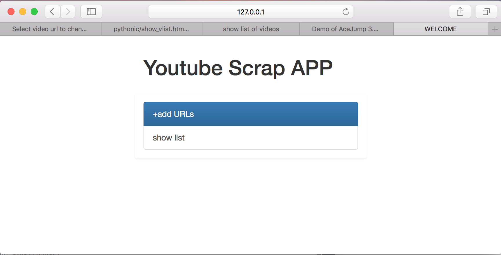
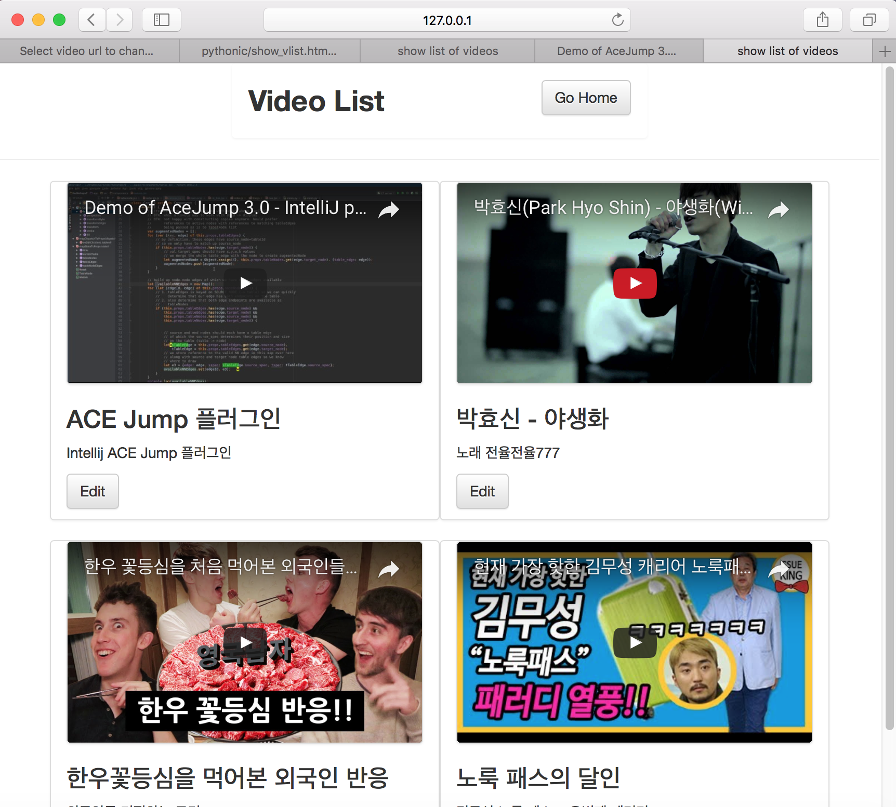
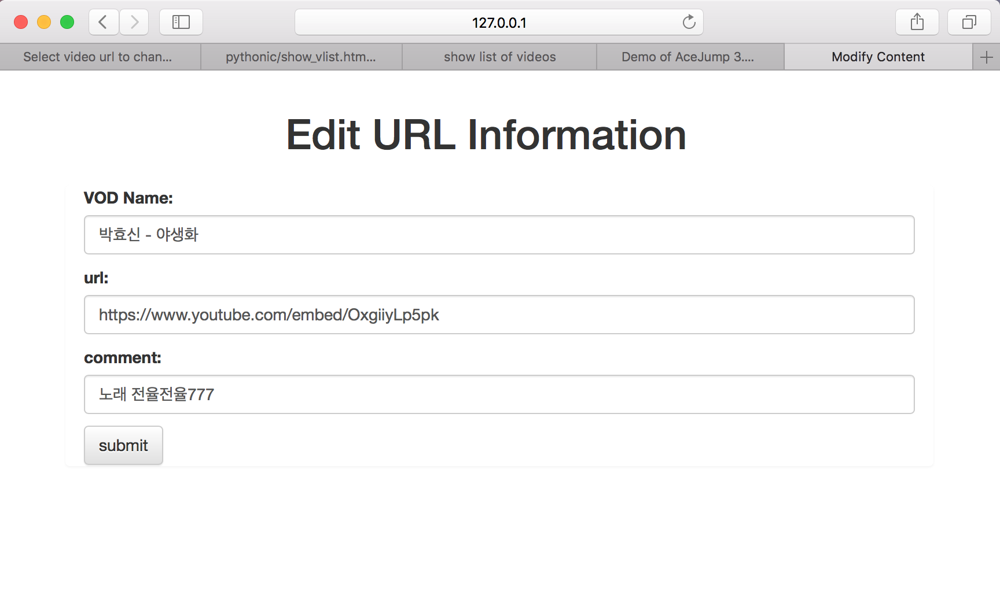

# Video scrapping APP (youtube, vimeo, etc)
### 설명
https://github.com/wonderboy39/pythonic 의 디렉터리가 너무 복잡해지기도 했고, 만들려는 APP의 구현 목표가 뚜렷해져서 이곳으로 따로 리포지터리 개설

### 브랜치 계획
(hotfix, front, back, md) -> development -> master  
- 기초적인 골격이 나올때까지는 master에서 작업  
- master브랜치에서 완료해놓을 작업들  
 : 문서화, 소스 정리, view 코드의 폼, 모델 관련 코드들을 class단위로 구성되도록 변경하는 작업수행해야 함
 : mysql을 사용하는 코드로 변경
 : vue.js도입 여부 검토
 

### 디렉터리 구조
- MD : 요약, trobleshoot, 배운내용 및 공부한 내용들 정리하는 디렉터리  
- projects : 실제 프로젝트 디렉터리들  
  1) scrapper  

### 지금까지 완료된 기능들
index, list, modify 페이지 뷰,모델, 템플릿 코드 완성
index페이지  
  
  
list페이지
  
  
edit페이지
  
  

